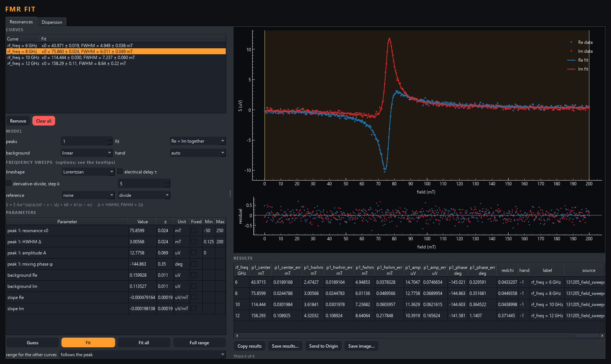
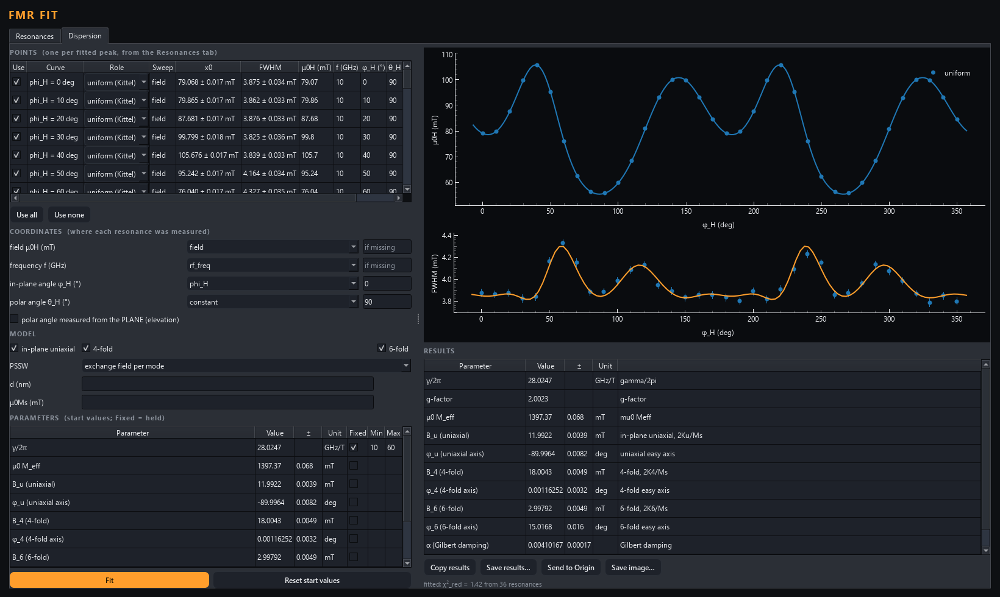
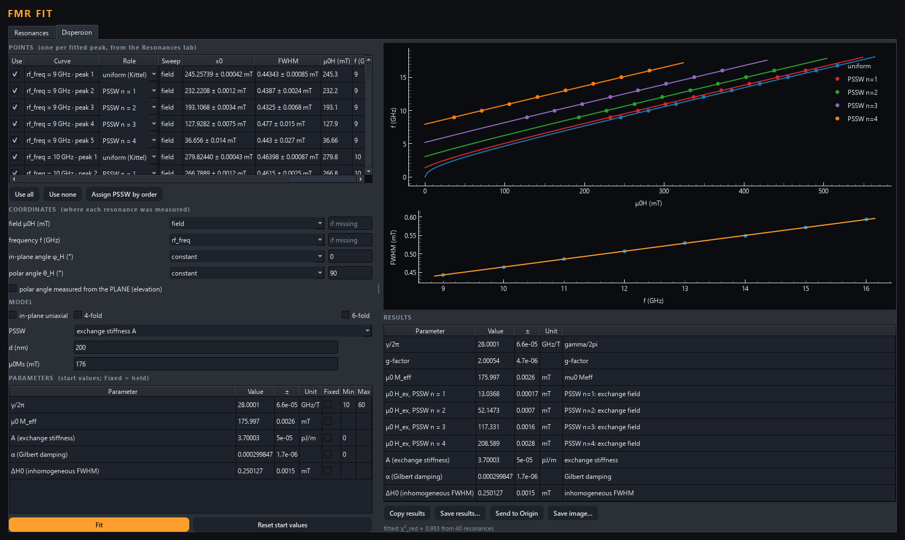

# FMR fit

An AaltoView analysis module (drop-in: this folder in `AnalysisModules/`). It fits ferromagnetic resonances on 1-D curves
measured by direct detection (a VNA's S21; not the derivative lineshape of a
field-modulated lock-in).

## The model

    S(x) = Σ_k A_k e^{iφ_k} Δ_k / (x0_k − x − iΔ_k)  +  b0 + b1 (x − xc)

- **x0** is the resonance position (field or frequency: x is whatever the
  sweep was).
- **Δ is the HWHM** (half width at half maximum). The FWHM is 2Δ, and both
  appear in the results.
- **A** is the amplitude, in the unit of the data.
- **φ is the mixing phase.** An uncalibrated VNA mixes the symmetric
  (absorption) and antisymmetric (dispersion) shapes. Because φ is fitted,
  the width comes out right regardless.
- **b0, b1** are a constant or linear background (complex for complex data),
  measured from the centre of the fit range xc.

Fit modes:

- **Re + Im together** (the default for complex data) fits both quadratures at
  once. It gives the most reliable x0 and Δ.
- **One channel** fits the part AaltoView showed. |S21| only works when the
  background is much larger than the peak.

**hand**: which way the complex signal turns through resonance. This depends
on the sweep and the instrument, and complex conjugation cannot be undone by a
phase. On *auto*, both are tried and the better one is kept.

## Use

1. In AaltoView, 1D plots: add the sweeps, then **Analysis → Start FMR fit
   and send** (or **Send to FMR fit** if it is already open).
2. Each curve arrives with guessed start values (dashed line).
3. **Fit** fits the curve on screen. **Fit all** fits every curve with the same
   model, one at a time: each row fills in as it is fitted, and the button reads
   **Stop** meanwhile (about 0.25 s per 4096-point sweep, so 174 sweeps take a
   minute). **Predict + fit the others** works the same way.
4. In the parameter table you can type a start value, tick **Fixed**, or set
   **Min/Max**. Drag the shaded band on the plot to fit only part of the sweep.
5. **Peaks** > 1 is for the Kittel mode plus standing spin waves. A new peak is
   guessed from what the others leave.
6. A fit marked **⚠ check** has a width or amplitude smaller than its own error
   bar. The fit converged, but the peak was not found.
7. Results come out with one row per curve: the held coordinate (e.g.
   rf_freq) first, then per peak the values with 1σ errors. Copy them, save
   them as `.csv`/`.dat`, or send them to Origin (error columns are set as
   error bars). **Save image** saves data, fit and residuals.

## Frequency sweeps (VNA): options

A VNA frequency sweep is harder to fit than a field sweep. The line is not
quite a Lorentzian in f, and the cables add a background that changes with
frequency. The **FREQUENCY SWEEPS** box has four options; you can combine
them and they apply to Fit all too.

| Option | What it does | Use it when |
|---|---|---|
| **lineshape: oscillator** | χ = 2f₀Δ/(f₀² − f² − i·f·2Δ), the damped oscillator, exact in f. It has the same x0 and HWHM Δ as the Lorentzian, which is its limit near resonance. | Broad lines at low frequency: the Lorentzian is off by about Δ/f₀. Not for field sweeps. |
| **electrical delay τ** | Multiplies the whole signal by e^{−i2πτ(f − fc)}. The start value comes from the phase slope. τ is in ns for GHz. | Always for an uncalibrated VNA: 3 ns turns the phase once every 0.33 GHz. |
| **derivative-divide, step k** | Fits D = (S(f₊) − S(f₋)) / ((f₊ − f₋)·S(f)) (Maier-Flaig et al., Rev. Sci. Instrum. 89, 076101 (2018)). A background that multiplies the signal and varies slowly drops out. The model goes through the same finite difference exactly, and with the delay option it is exact for the delay too. The amplitude becomes relative. | A smooth background. Choose k so the step is about the linewidth, because the noise is divided by the step. |
| **reference: divide / subtract** | Takes another received curve out before the fit, interpolated onto this curve's axis: e.g. a sweep at a field where nothing resonates in the band. | Standing-wave ripple and anything else that doesn't change with field. Record it on the same frequency grid. |

On the simulated VNA sweeps (`tools/make_demo_data.py`, file 7: 3.2 ns delay,
2 % ripple, sloped loss, oscillator lineshape):
- **reference divide + oscillator** gives f₀ and the width within their error
  bars;
- **plain Lorentzian** fails completely;
- **delay alone** can't remove the ripple;
- **derivative-divide** is exact on a smooth background, but a ripple as large
  as the resonance survives the differencing. It scatters by about 0.5 % in
  f₀ and 20 % in the width.

## Dispersion: from resonances to material parameters

The second tab takes every fitted peak (x0 and FWHM, with errors) and fits them
all with one magnetic model.

- **Points**: one row per fitted peak.
  - Untick a row to leave it out.
  - **Role** says which mode the peak is: *uniform (Kittel)*, *PSSW n = 1, 2,
    …*, or *ignore*. The strongest peak of each curve starts as uniform.
- **Coordinates**: where each resonance was measured, taken from the file's
  dimensions and their units.
  - Field is T/mT/Oe/A/m, frequency is Hz/MHz/GHz, and an angle is deg/rad.
    An angle named theta/polar is the polar angle; any other angle is
    in-plane.
  - Whatever the file doesn't have is a constant: by default θ_H = 90°
    (in-plane) and φ_H = 0.
  - The curve's own x axis is what was swept.
  - Field sweeps at an angle, frequency sweeps at a field, and mixtures of
    both are all fitted together.
- **Model** (energy per Ms, in field units; θ from the film normal):

  E = −μ0H(m·h) + (M_eff/2) m_z² − (B_u/4) sin²θ [1 + cos 2(φ−φ_u)]
      − (B_4/16) sin⁴θ [3 + cos 4(φ−φ_4)] − (B_6/36) sin⁶θ cos 6(φ−φ_6)

  - For each point, the equilibrium of m is found numerically (the lowest
    minimum). The resonance follows from the curvature of E (Smit–Beljers).
  - With the field in-plane this reduces to the textbook formula
    f = γ/2π·√((H cos(φ−φ_H) + B_u cos 2Δφ_u + B_4 cos 4Δφ_4 + B_6 cos 6Δφ_6)
    (H cos(φ−φ_H) + M_eff + B_u cos² Δφ_u + B_4(3 + cos 4Δφ_4)/4 + B_6 cos 6Δφ_6/6)),
    so B_n = 2K_n/Ms.
  - Perpendicular anisotropy is in μ0M_eff = μ0Ms − 2K⊥/Ms.
- **PSSW**: the exchange field H_ex,n is added to both stiffnesses. You can
  fit it per mode, or through the exchange stiffness A with
  H_ex,n = 2A(nπ/d)²/Ms (unpinned surfaces; needs d and μ0Ms, not M_eff).
- **Damping**: frequency FWHM = α·γ/2π·(E_aa + E_bb) + ΔH0·df/dH; divide by
  df/dx for a sweep along x.
  - In-plane this is the familiar ΔH = ΔH0 + 2αf/(γ/2π) (FWHM).
  - At other angles it includes the lag of the magnetisation behind the field.
- **Fit** order: positions first, then α and ΔH0 of the uniform mode. The
  position fit runs in stages: M_eff and exchange, then the anisotropy, then
  γ with everything else. Without the stages, the fit fell into false minima.
- **γ and M_eff** can only both be fitted when there is more than one point
  of the Kittel curve, i.e. several frequencies or fields. With one, γ starts
  fixed at g = 2.0023, and the status line says so.
- **Results**: value ± 1σ with unit and meaning. You can copy them, save them
  as `.csv`/`.dat`, send them to Origin, or save both plots as an image.

## Uniform mode and PSSW together: 200 nm YIG

The demo file `093000_yig_200nm_field_sweeps.nc` (from
`tools/make_demo_data.py`) simulates 200 nm of YIG with the field in-plane,
field sweeps at 9–16 GHz. It has the uniform mode plus four standing spin
waves at lower field, with H_ex,n = 2A(nπ/d)²/Ms = 13, 52, 117 and 209 mT
(A = 3.7 pJ/m, μ0Ms = 176 mT). The workflow:

1. **Resonances:** set **peaks = 5** and click **Fit all**.
   - Peaks are found as local maxima ranked by prominence, so a weak mode
     next to a strong line is not lost.
   - With several peaks, the hand is decided first on the strongest line.
2. **Dispersion:** click **Assign PSSW by order**.
   - In each sweep, the strongest peak is uniform.
   - The peaks at lower field become n = 1, 2, … by their distance from it.
   - Check the plot: each order should lie on its own line. A mode too weak
     to fit would shift the numbering of the ones beyond it.
3. Set **PSSW → exchange stiffness A**, **d = 200 nm**, **μ0Ms = 176 mT**,
   then click **Fit**.
   - One A for all orders, with M_eff and γ shared with the uniform mode.
   - The fit gives back A = 3.700 pJ/m, M_eff = 176.0 mT,
     γ/2π = 28.00 GHz/T and α = 3.0·10⁻⁴.
   - With **exchange field per mode** instead, each H_ex,n is fitted on its
     own, and A per mode is shown when d and μ0Ms are given. That's a check
     of the n² law: pinning or a wrong d shows up as a different A per mode.

## The lab's way: field set, VNA frequency sweep

The demo file `141500_yig_200nm_vna.nc` is the same YIG measured this way.
It has S21 at 25–300 mT, 2–18 GHz in 1 MHz steps (the lines are only about
10 MHz wide in frequency), a 3.2 ns cable delay, standing-wave ripple, a
sloped loss, and a reference sweep at 800 mT, where nothing resonates below
18 GHz.

1. **Send all 13 sweeps.** They arrive with the oscillator lineshape and the
   delay option on, and are drawn with the delay taken out.
2. **Reference:** choose `field = 800 mT`, divide. That removes the ripple
   and the delay. Record your own reference on the same frequency grid.
3. **Set peaks = 5 and click Fit all.** The reference itself isn't fitted.
4. **Watch the ⚠ marks.** At 25 mT the uniform mode is at 1.98 GHz, below
   the sweep, so the fifth peak there is made up and gets flagged
   ("amplitude under 3 sigma"). Untick that sweep's points in the Dispersion
   tab, or fit it with 4 peaks. Left in, it shifts the order-based roles and
   pulls M_eff to 179 mT.
5. **Dispersion:** click **Assign PSSW by order** (PSSW lie at *higher*
   frequency here). Set the exchange stiffness A with d = 200 and
   μ0Ms = 176, then click **Fit**. That gives back A = 3.700 pJ/m,
   M_eff = 176.0 mT and γ/2π = 28.00 GHz/T.

## Let the dispersion fit the rest

Fitting dozens of sweeps one by one is slow, and "by order" breaks when a mode
is missing from a sweep. Instead:

1. **Fit a few curves by hand**, spread over the range, e.g. 3 fields.
   Select them (Ctrl-click in the list), then click **Fit selected**. To help
   a fit, type start values in the table, or **Ctrl+click on the plot** to
   put a peak where you see one.
2. **Dispersion:** set their roles (**Assign PSSW by order**, or by hand),
   then click **Fit**. A rough dispersion is enough.
3. Click **Predict + fit the others.** For every curve not fitted by hand,
   the dispersion predicts which modes lie inside its range, where, and how
   wide.
   - Those become its peaks, with their **roles already set**.
   - A mode outside the sweep is simply left out: at 25 mT the uniform mode
     is below 2 GHz, so that sweep gets PSSW 1–4 and nothing made up.
   - **Tight** (the default) keeps each peak within ± N linewidths of the
     prediction (N = 3, editable) and its width within a factor 3. **Loose**
     uses the prediction only as the start.
   - A peak that ends at the edge of its window is flagged ⚠, because the
     line is probably elsewhere.
4. The dispersion is then refitted with everything, if that box is ticked.
   Click the button again to redo the predicted curves from the better
   dispersion. Curves fitted by hand are never replaced.

On the lab-style YIG sweeps, 3 hand-fitted sweeps are enough: all 12 are
predicted within 0.003 GHz, and A, M_eff and γ come back exactly.

## Working through a series

- **Settings carry over.** When you set up or fit one curve and move to the
  next, it takes the same settings: peaks, fit mode, background, hand,
  lineshape, delay, derivative-divide and reference. A curve you've already
  set up or fitted keeps its own. The fit range has its own rule (see "range
  for the other curves").
- **Frequency sweeps start sensibly.** A curve whose x axis is a frequency
  gets the oscillator lineshape. If its phase winds more than two turns (a
  VNA's cable delay), the delay option is switched on. With the delay option
  on, the data, the fit and the residuals are drawn with the delay taken out
  (S·e^{+i2πτ(f−fc)}). Otherwise Re and Im spin with the phase and look like
  noise.

## Tests

- `tests/test_fmr_model.py` recovers known parameters from simulated signals,
  including the Kittel resonance fields and linewidths of the demo data.
- `tests/test_fmr_dispersion.py` checks the magnetic model against formulas
  derived independently (the in-plane textbook formula with every anisotropy,
  the perpendicular case, PSSW, the linewidth), then recovers anisotropies,
  exchange stiffness and damping from synthetic points.
- `tests/test_fmr_demo_chain.py` runs the whole chain on the simulated
  anisotropic film of `tools/make_demo_data.py`, which is computed without
  this module's code. The chain is curves → Lorentzian fits → points →
  anisotropy, M_eff, γ, α.
- `tests/test_fmr_app.py` and `tests/test_fmr_dispersion_tab.py` cover the
  windows.

## Next

Planned: fitting every row of a map in one go, a notebook that repeats the
fits, and a second-order perpendicular term (K2) if thin PMA films need it.
