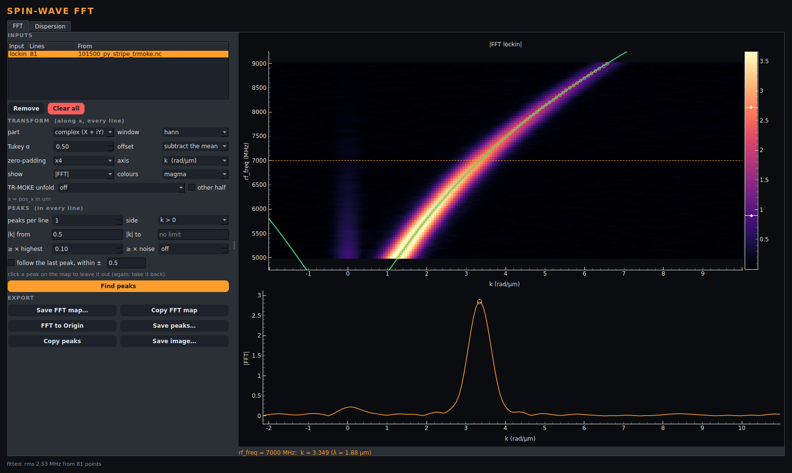
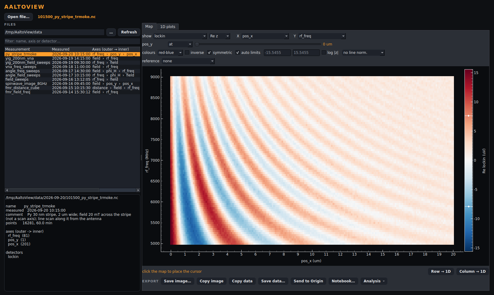
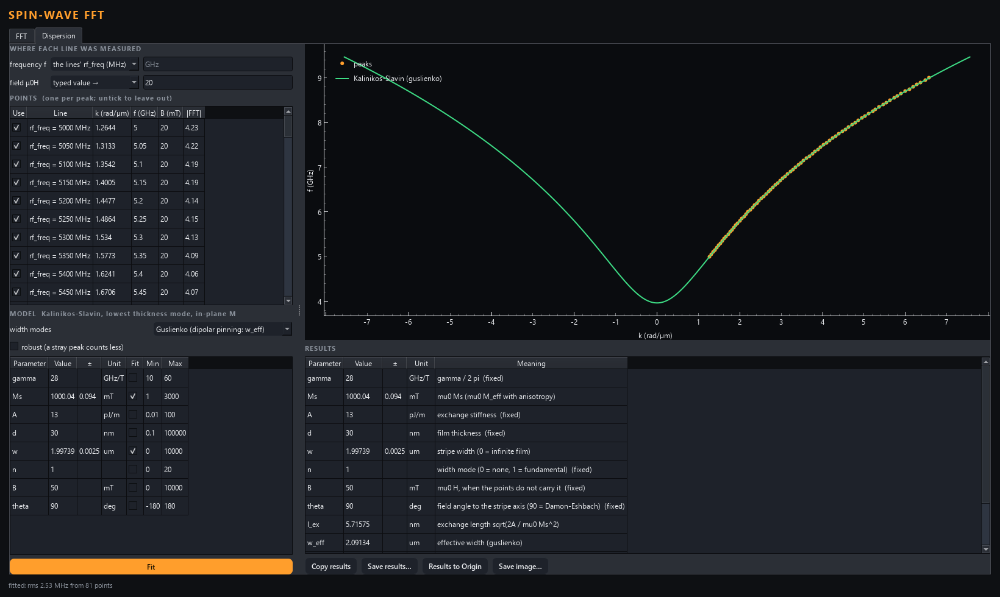

# Spin-wave FFT

An AaltoView analysis module (drop-in: this folder in `AnalysisModules/`). It
takes a spin-wave measurement along a position axis and does three things:

1. transforms every line into k-space (a spatial FFT);
2. finds the wavevector in each line;
3. fits the spin-wave dispersion of a magnetic stripe through the (k, f)
   points: Kalinikos–Slavin, with Guslienko's effective width.

*The simulated 30 nm × 2 µm permalloy stripe (`tools/make_demo_data.py`,
file 10), sent from the viewer's Map tab. Top: |FFT| of every frequency line
(k across, rf_freq down), the peaks (circles) and the fitted dispersion (green).
Bottom: the line at 7 GHz.*

## Getting data in

- **Map → Analysis** in AaltoView sends the whole map, e.g. X = `pos_x`,
  Y = `rf_freq`, with any reference the map has. The FFT runs **along X**, one
  line per Y value. Choose X in the viewer before sending.
- **1D plots → Analysis** also works: curves on one x grid are stacked into
  one input, one line per curve, ordered by the dimension they differ in.

## The FFT

    F(k) = Σ_j w_j (v_j − trend) e^{−i k x_j} / Σ_j w_j

| option | what it does |
|---|---|
| **part** | *complex (X + iY)*: a wave travelling towards +x appears at +k only, one towards −x at −k (convention e^{i(kx − ωt)}). *Re*, *Im*, *\|z\|*: a real signal is its own mirror image, so the sign of k means nothing. |
| **window** | none, Hann (default), Hamming, Blackman, Tukey (α = the tapered fraction). The window trades peak sharpness against leakage from the ends of the scan. |
| **offset** | subtract the mean (default) or a fitted line, so the offset doesn't sit at k = 0 and leak into the peaks. |
| **zero-padding** | ×1…×16. Gives a smoother spectrum and a better peak position. It does **not** separate two close peaks: the resolution is 2π / L, where L is the length scanned. The status line shows it. |
| **axis** | **k in rad/µm** (k = 2π/λ) or **1/λ in 1/µm**. The x unit (nm, µm, mm, m) is converted to µm. |
| **show** | \|FFT\|, \|FFT\|² or log10 \|FFT\|. |

The spectrum is **normalised by the sum of the window**: a pure wave of
amplitude A gives |F(k₀)| = A whatever the window, length or padding. Uneven
steps are interpolated onto an even grid, and NaN holes (a running or aborted
scan) are interpolated across. A line with fewer than 4 points gives an empty
spectrum.

Click the map to show that line in the lower plot.

## Peaks

Per line, the strongest local maxima are found:

- up to **peaks per line** of them;
- on **both signs**, **k > 0** or **k < 0**;
- inside **|k| from … to** (leave out what is left of the offset near k = 0);
- only those reaching a set fraction of the line's highest point.

Each position is refined between bins with a parabola through log|F|. The
table gives, per peak: the line, k (signed), |k|, λ, the amplitude and the
width in k.

## Dispersion: Kalinikos–Slavin + Guslienko

**Where each line was measured.** The frequency comes from the lines' own axis
when it is a frequency (Hz/MHz/GHz are converted to GHz), from a held
coordinate, or from a value you type. The field works the same way, and is
converted to mT from T/mT/Oe/G/A/m. A TR-MOKE file that keeps the field only
in its comment needs the value typed in (its sign doesn't matter).

**The model.** Kalinikos & Slavin, J. Phys. C 19, 7013 (1986): the lowest
thickness mode, with the film magnetised in-plane.

    f = γ/2π · √((B + Ms·λ·k²)(B + Ms·λ·k² + Ms·F))
    F = 1 − P cos²φ + Ms·P(1 − P) sin²φ / (B + Ms·λ·k²)
    P = 1 − (1 − e^{−kd}) / (kd),      λ = 2A / (μ0 Ms²)

**The stripe.** Across its width the mode is a standing wave with
k_y = nπ / w_eff. The edges are partly pinned by the dynamic dipolar field
(Guslienko, Demokritov, Hillebrands & Slavin, PRB 66, 132402 (2002)), which
acts like a wider stripe:

    w_eff = w · D / (D − 2),   D = 2π / (p (1 + 2 ln(1/p))),   p = d / w

- The wavevector is k² = k_x² + k_y², where k_x is the one measured.
- With the field at angle θ to the stripe axis,
  cos²φ = (k_x² cos²θ + k_y² sin²θ) / k².
- θ = 90° (field across the stripe) is the Damon–Eshbach geometry of most
  waveguide experiments; θ = 0 is backward volume.
- n = 0, or w = 0, gives an infinite film.
- **unpinned edges** uses the geometric w instead of w_eff.
- **none: infinite film** switches the width mode off (k_y = 0). w and n are
  then greyed out and not fitted, even if their Fit box was ticked.

**Parameters.** γ/2π, μ0Ms, A, d, w, n, B and θ. Each can be fitted or held,
with optional bounds, and comes with a 1σ error. The fit is least squares in
frequency. **robust** makes a stray peak count less. The results also give the
exchange length, w_eff, k_y and the band bottom f(k = 0). The fitted curve is
drawn on the Dispersion plot and, when the lines are frequencies, on the FFT
map.

What the data can determine:
- μ0Ms comes from the slope of f(k). The band bottom f(k_x = 0) depends on B,
  Ms and k_y, i.e. w_eff.
- A matters only at large k (k·l_ex no longer small).
- d enters through P (the dipolar term) and through w_eff.
- Fit a few parameters at a time. When a parameter's error comes out larger
  than its value, the status line says so.

## Exports

| button | what |
|---|---|
| Save FFT map… / Copy FFT map | the spectrum as it is shown, as a matrix (k across, lines down) or XYZ columns |
| FFT to Origin | a matrix + colour map in a running Origin |
| Save peaks… / Copy peaks | one row per peak: line, k, \|k\|, λ, amplitude, width, plus the f and B used in the dispersion |
| Save image… | the FFT map with the peaks and the fit (PNG, PDF, SVG) |
| Copy / Save results, Results to Origin | the fitted parameters with 1σ errors |

All tables have AaltoView's three header rows (name / unit / comment).

## Tests

- `tests/test_sw_fft.py` checks the transform against waves with a **known**
  k:
  - both travel directions, and real vs complex data;
  - units, holes, uneven steps, offsets, padding vs resolution;
  - several peaks per line, and the width of the Hann peak.
- `tests/test_waveguide.py` checks the model against independent formulas:
  - Kittel at k = 0;
  - the textbook exchange lengths (permalloy 5.7 nm, YIG 17 nm);
  - the small-k slopes of the Damon–Eshbach and backward-volume branches;
  - the exact Damon–Eshbach surface wave, which Kalinikos–Slavin matches to
    first order in kd and exceeds by Ms²(kd)²/12 at second;
  - Guslienko's w_eff;
  - it then recovers known parameters from noisy points.
- `tests/test_sw_chain.py` runs the whole chain on demo file 10, a stripe whose
  k(f) is computed in `tools/make_demo_data.py`, not with this module:
  - every peak lies within a tenth of the resolution of the true k;
  - the fit gives back μ0Ms to 0.5 % and the width to 5 %;
  - unpinned edges read the same data as a stripe of width w_eff.
- `tests/test_sw_app.py` drives the window: map in, peaks, the field typed in,
  the fit, a change of k unit, every export.
