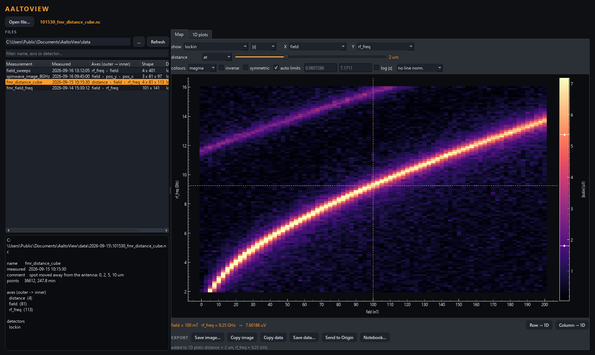
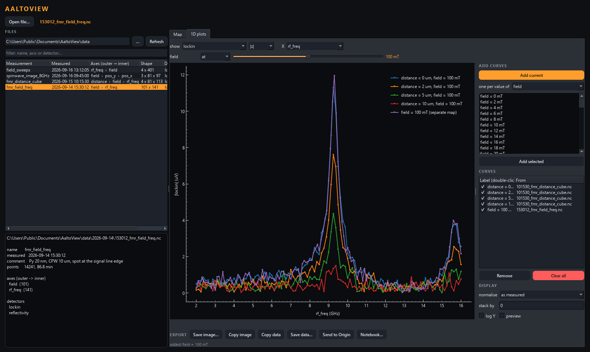
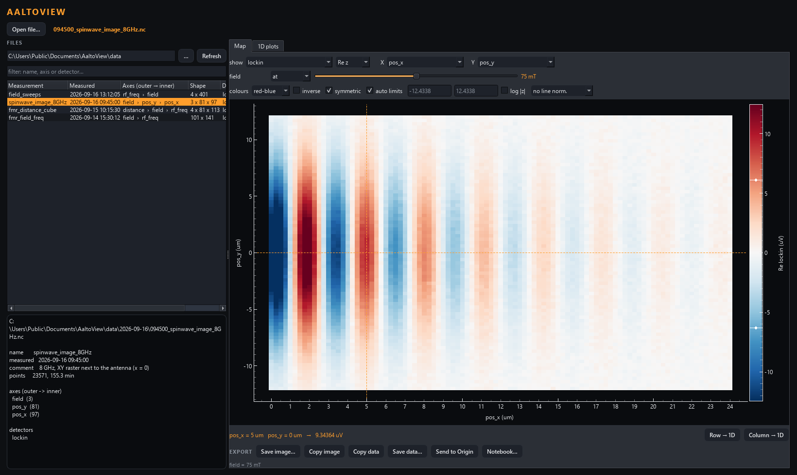
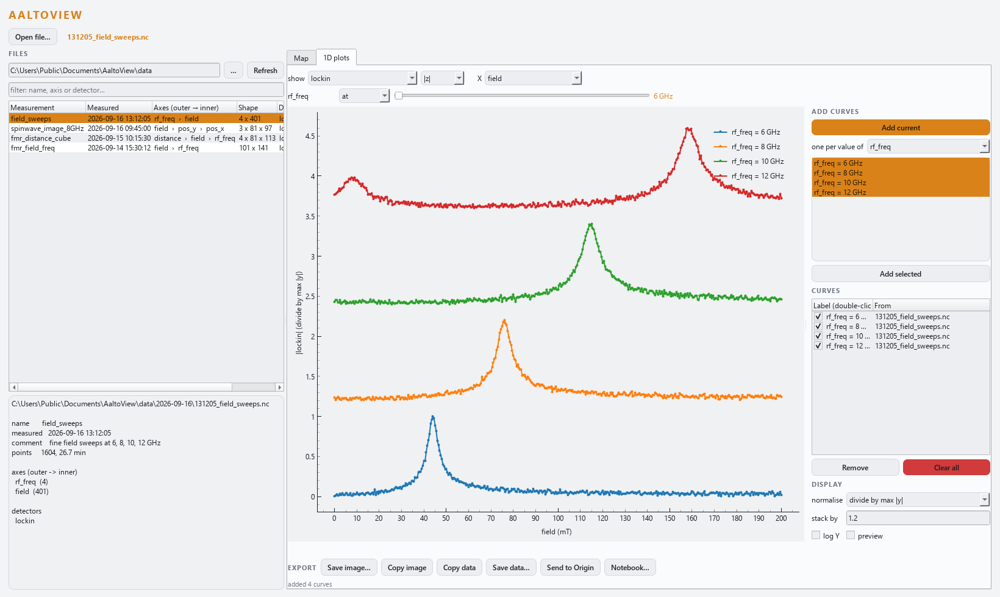
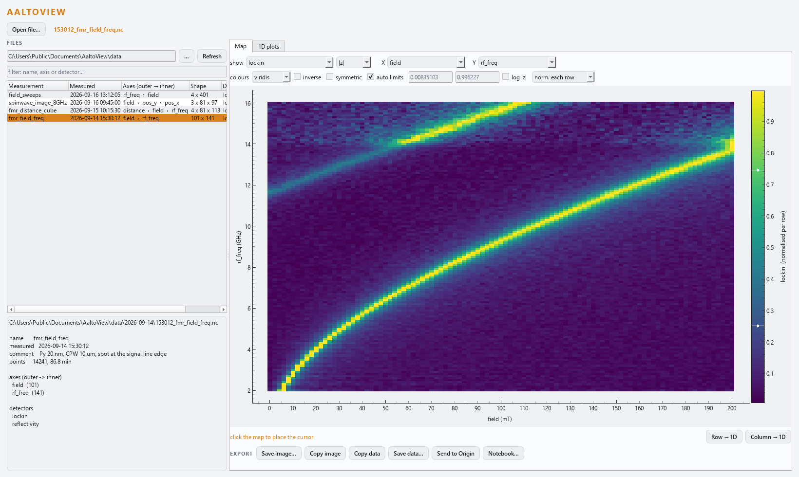

# AaltoView

[](https://doi.org/10.5281/zenodo.22959226)

A data viewer for **time-resolved MOKE and FMR measurements** (Aalto University,
NanoSpin group), the Python successor of the LabVIEW **AaltoView**, whose name it carries again
(it was `trmoke-dataviewer` until 2026-09-24). Open a scan of
any number of dimensions, look at it as a map or as overlaid curves, average what
you do not need, and send the result to a figure, a text file, **Origin** or a
**Jupyter notebook**. It reads the `.nc` files the AaltoFlow scan engine writes and
needs no instruments.



*A three-dimensional measurement (distance from the antenna × field × RF
frequency) shown as field against frequency, with the distance held at 2 µm: the
Kittel mode and a weaker standing spin wave. The cursor sits on the resonance;
**Row → 1D** sent the spectrum through it to the 1D plots. All screenshots use
simulated data (see [Try it without lab data](#try-it-without-lab-data)).*

- **Files** — a data folder (day sub-folders included), newest first, with each
  measurement's axes, shape and detectors, and the selected file's header.
- **Map** — any two dimensions as X/Y. Every other dimension gets a row: hold it
  at one value (a slider showing the coordinate) or average it (all of it, or a
  range). Colour map, inverse, symmetric limits, automatic (percentile) or typed
  limits — or drag the colour bar — log, and normalise each row or column. Click
  to place a cursor; **Row → 1D** / **Column → 1D** send the line through it.
- **1D plots** — a dashed preview of the current selection. **Add current**, or
  pick a dimension, select several of its values and **Add selected** (one curve
  per value). Curves are frozen copies that remember their file, so curves from
  different measurements overlay. Normalise (peak, 0…1, first point, zero mean),
  stack as a waterfall, log Y, rename, hide, remove.
- **Export**, from both tabs:
  | | |
  |---|---|
  | Save image | publication-style PNG / PDF / SVG (white background) |
  | Copy image / Copy data | to the clipboard (data tab-separated) |
  | Save data | `.dat` / `.csv` with Long Name / Units / Comments header rows; a map as a matrix or XYZ columns |
  | Send to Origin | into a running Origin (or starts one): worksheet + graph, or matrix + colour map |
  | Notebook | a Jupyter notebook that **recomputes** the view from the `.nc` files |



*1D plots: the spectrum at 100 mT for every distance, added in one go with "one per
value of distance", plus the same spectrum from a separate measurement on a
different frequency grid. Each curve remembers the file it came from.*



*A complex lock-in signal shown as its real part, red-blue with symmetric limits:
spin waves travelling away from the antenna at 8 GHz. The field is one of three,
held on its slider; |z|, arg z, Re z and Im z are one click apart, and averages of
a complex signal are taken coherently.*

| | |
|---|---|
|  |  |
| Field sweeps at 6–12 GHz, each normalised to its peak and stacked. | The same kind of map with every frequency line scaled to its own peak, so the resonance can be followed where the signal is weak. Light theme. |

## Install and run

```bash
git clone https://github.com/FlashLukas/AaltoView.git
cd aaltoview
uv sync --extra gui                  # add --extra origin for "Send to Origin"
uv run aaltoview             # or: uv run aaltoview path\to\scan.nc --folder D:\data
```

`uv` brings its own Python (3.11 or newer). The `origin` extra installs
OriginLab's `originpro` package and works on Windows with Origin 2021 or newer
installed; without it, every other export still works.

It starts in the folder you used last time (or the AaltoFlow suite's data
directory, if the suite is installed on the same PC).

## Try it without lab data

```bash
uv run python tools/make_demo_data.py demo_data     # four simulated measurements
uv run aaltoview --folder demo_data
```

The simulated measurements are a permalloy-like film: the Kittel mode
f = γ/2π·√(B(B + μ0Ms)), a weaker perpendicular standing spin wave, a linewidth
growing with frequency, detection phase and noise. They are a field × frequency
map, a distance × field × frequency cube, a spin-wave image at 8 GHz for three
fields, and field sweeps at four frequencies. `tools/render_docs.py` regenerates
them and every screenshot above.

## Without the window

Everything except the window is plain Python and can be used in a script or a
notebook:

```python
from aaltoview.data import load
from aaltoview.view import Slice
from aaltoview import export as E

ds = load("demo_data/2026-09-15/101530_fmr_distance_cube.nc").load()

# a map: field x frequency, 2 um from the antenna (distance index 1)
sel = E.Selection("lockin", x="field", y="rf_freq", slices={"distance": Slice("at", 1)})
m, _ = E.make_map(ds, sel, E.MapStyle(cmap="magma"))
E.save_figure(E.figure_map(m), "map.png")

# one spectrum per distance at 100 mT (field index 40), peak-normalised, to a file
curves = E.curves_along(ds, E.Selection("lockin", x="rf_freq",
                                        slices={"field": Slice("at", 40)}),
                        "distance", range(4))
E.write_curves("curves.dat", curves, norm="peak")
```

## The files it reads

netCDF-4 (HDF5), one variable per detector, named coordinates with a `units`
attribute, and these conventions from the AaltoFlow scan engine:

- a complex detector is stored as `<name>_real` + `<name>_imag` (attributes
  `complex_pair` / `complex_part`), because a native complex netCDF variable is
  not readable by MATLAB or Igor; the viewer recombines it and averages it
  **coherently** (the complex mean first, then |z| or arg z);
- dataset attributes `name`, `comment`, `dims` (outer → inner), `n_points`,
  `seconds`, `recipe_json`;
- autosaves are named `<YYYY-MM-DD>/<HHMMSS>_<name>.nc`, which is where the
  "measured" time in the file list comes from.

## Not yet

AaltoView's TR-MOKE corrections: laser repetition rate (80 / 100 MHz), harmonic,
folding of the demodulation frequency, the amplitude correction file, and phase
autocorrection.

## Tests

```bash
uv run pytest -q                              # 42 tests, offline, GUI offscreen
uv run python tools/render_docs.py            # refresh the screenshots in docs/
$env:AALTOVIEW_TEST_ORIGIN = "1"; uv run pytest -q -k origin    # also pushes into Origin
```

## How to cite

If you publish scientific work with data analysed or plotted using AaltoView, we
would be grateful for a citation. [`CITATION.cff`](CITATION.cff) has the details
(GitHub's "Cite this repository" button gives it as BibTeX or APA); in short:

> L. Flajšman, *AaltoView: a viewer for N-dimensional measurement data*,
> NanoSpin group, Aalto University, https://github.com/FlashLukas/AaltoView,
> doi:10.5281/zenodo.22959226

DOI: [10.5281/zenodo.22959226](https://doi.org/10.5281/zenodo.22959226) (always the latest version; Zenodo lists the DOI of each
release too).

## Credits and licence

AaltoView was developed by Lukáš Flajšman in the NanoSpin group, Aalto
University, as the data viewer of [AaltoFlow](https://github.com/FlashLukas/AaltoFlow).
The copyright is held by Aalto University.

MIT -- see [LICENSE](LICENSE).
