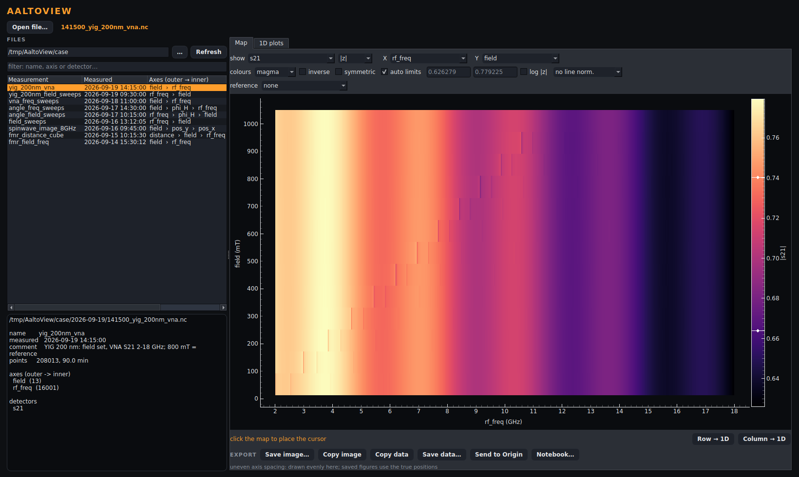
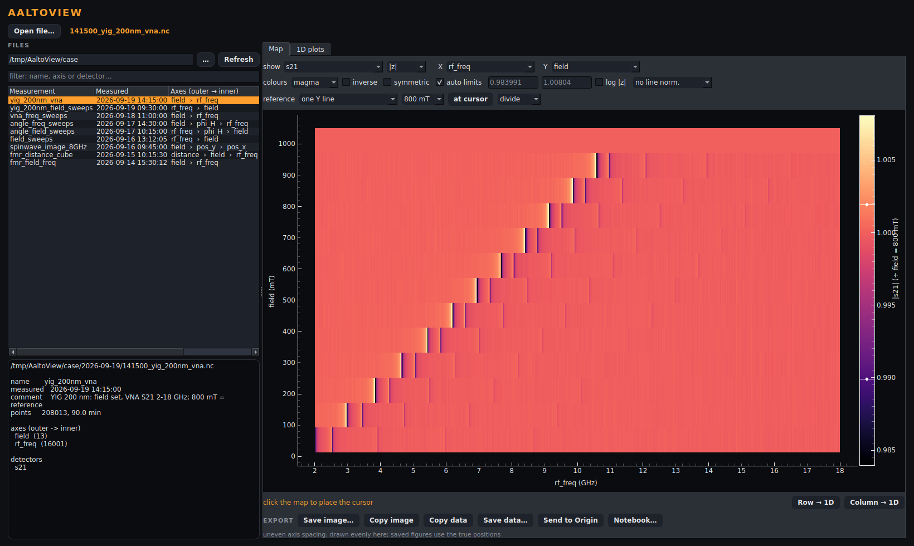
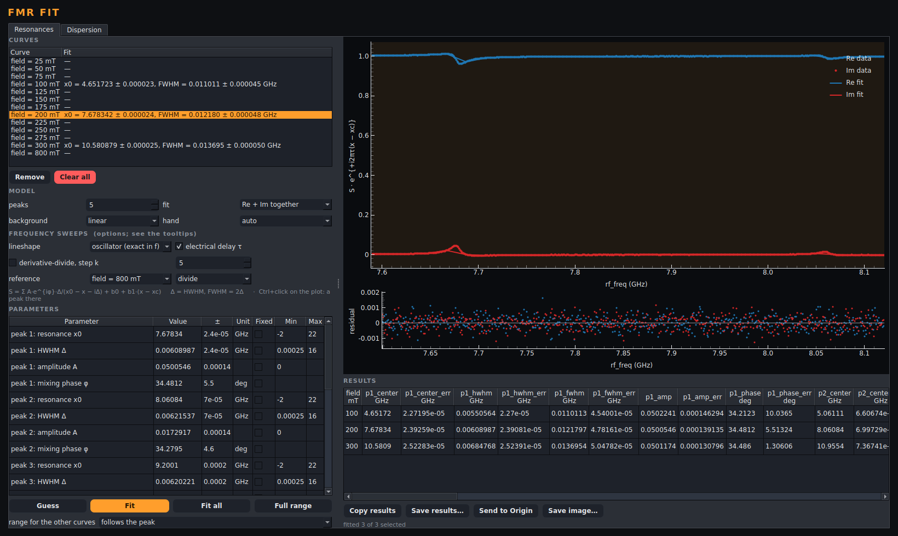
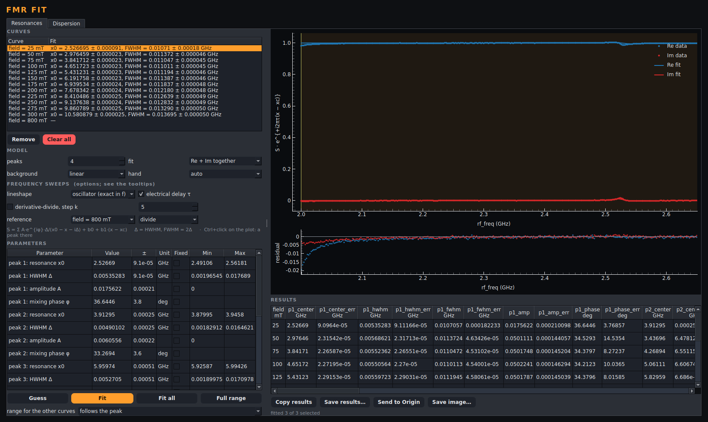
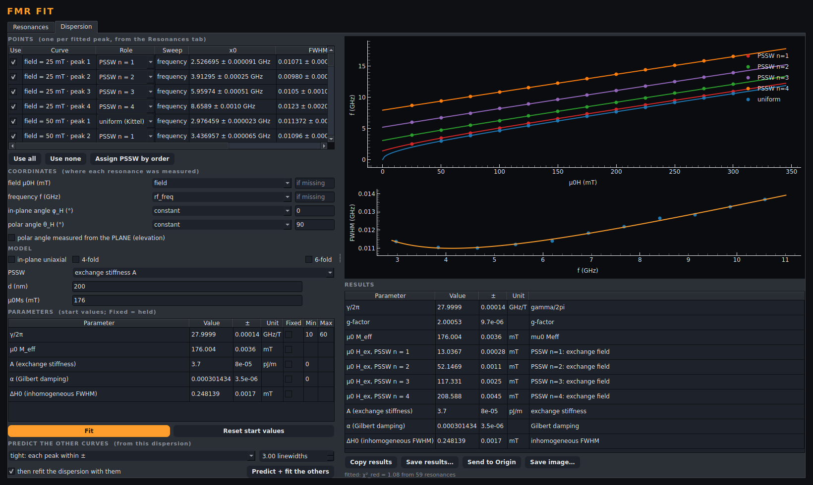

# Case study: FMR with standing spin waves, background removed, three fits → all

This is a worked example from raw VNA data to the exchange stiffness. It uses
the viewer and the **VNA-FMR fit** module
([AnalysisModules/vna-fmr-fit](../AnalysisModules/vna-fmr-fit/README.md)) the way you
would at the lab PC. It shows three things:

1. **Background subtraction.** The cables, the amplifier and the stripline
   are removed from S21 before anything is fitted.
2. **Uniform mode + PSSW.** The Kittel mode and four perpendicular standing
   spin waves are fitted together, both quadratures at once.
3. **Fit three, let the dispersion do the rest.** Three sweeps are fitted by
   hand. A rough dispersion from those 15 resonances then places, bounds and
   labels the peaks of all the other sweeps, which are fitted from there. A
   final dispersion through one exchange stiffness gives the material
   parameters.

The data are simulated, so every number below can be checked against the
truth it was made from. `tools/case_study_fmr_pssw.py` runs the whole chain
headless, through the same windows. It writes the screenshots in
[`docs/case-study/`](case-study/) and the numbers in
[`numbers.txt`](case-study/numbers.txt). Re-run it after a change to the
module:

```bash
uv sync --all-packages --extra gui
uv run --all-packages python tools/case_study_fmr_pssw.py
```

## The sample and the measurement

200 nm of YIG, field in-plane. At each field the magnet is set, then the VNA
sweeps S21 from 2 to 18 GHz in 1 MHz steps. The file is
`demo_data/2026-09-19/141500_yig_200nm_vna.nc` from
`tools/make_demo_data.py`.

| | |
|---|---|
| fields | 25, 50, …, 300 mT (12 sweeps) + a **reference at 800 mT** |
| points | 16 001 per sweep, complex S21 |
| sample (truth) | μ0Ms = 176 mT, A = 3.7 pJ/m, d = 200 nm, γ/2π = 28 GHz/T, α = 3·10⁻⁴, ΔH0 = 0.25 mT |
| modes | uniform (Kittel) + PSSW n = 1…4, H_ex,n = 13.04, 52.15, 117.33, 208.59 mT |
| instrument | 3.2 ns cable delay, 2 % standing-wave ripple, loss sloping with f |

The physics is the Kittel formula with an exchange field added for each
standing wave (unpinned surfaces):

    f_n = γ/2π · √((B + B_ex,n)(B + B_ex,n + μ0M_eff)),     B_ex,n = 2A (nπ/d)² / Ms

So the **spacing between the PSSW gives A**, and the uniform mode gives γ and
M_eff. All five lines are only 11–14 MHz wide (FWHM) in a 16 GHz sweep.

## Step 1 – look at the raw map

In the viewer, open the file and choose **Map**, X = `rf_freq`, Y = `field`,
|z|.



What you see is the **instrument**. |S21| falls from 0.78 to 0.63 over the
band, and the resonances are small notches on top of it. In the complex
signal it is worse: the 3.2 ns delay turns the phase once every 0.31 GHz, so
Re and Im oscillate about 50 times across the band.

## Step 2 – background subtraction: divide by the reference line

The VNA background *multiplies* the signal:
S21(f, B) = S_bg(f) · (1 + χ(f, B)). It does not depend on field, so one
sweep at a field where nothing resonates in the band (800 mT: the uniform
mode is at 25 GHz there) is S_bg(f) itself, and

    S21(f, B) / S21(f, 800 mT) = 1 + χ(f, B)

is the sample alone. Delay, ripple and slope cancel exactly. The division is
done on the complex values, so |z| and arg z are those of the ratio.

In the viewer, set **reference → one line: field = 800 mT, divide**.



The uniform mode and the PSSW ladder now stand out on a flat background.
Other ways to take the background out, for other data:

| reference option | when |
|---|---|
| **÷ one line** (above) | you measured a sweep where nothing resonates in the band. Record it on the same frequency grid. |
| **÷ the median line** | no reference was measured. At each frequency, the median over all fields is the background, because the resonance occupies only a few fields. |
| **− one line** (subtract) | the background *adds* to the signal (leakage, an offset) instead of multiplying it. |
| **derivative-divide** | a smooth background that varies slowly. See the module README on how to choose the step. |

The fit module has the same **reference** choice. It takes the reference
curve out of every curve before fitting, interpolated onto that curve's axis.

**Why it matters:** the 200 mT sweep fitted with 5 peaks, the oscillator
lineshape and the delay option, but **without** the reference, does not
converge, and the peaks it returns miss by up to 2 GHz:

| | peak positions (GHz) |
|---|---|
| found, no reference | 6.025, 6.049, 9.207, 12.474, 15.772 |
| truth | 7.678, 8.061, 9.200, 11.079, 13.684 |

The ripple is as large as the resonances, so the fit spends its peaks on the
ripple.

## Step 3 – fit three sweeps by hand

In **1D plots**: X = `rf_freq`, **one per value of field**, select all 13,
**Add selected**, then **Analysis → Start VNA-FMR fit and send**. Every sweep
arrives with the oscillator lineshape and the delay option on, because a
frequency sweep whose phase winds is recognised as VNA data.

Settings made on the curve on screen carry over to every curve not set up
yet, so make them **before you move to another curve**:

- **reference**: `field = 800 mT`, divide;
- **peaks**: 5, i.e. the uniform mode + PSSW 1–4.

Then Ctrl-click **100, 200 and 300 mT** in the curve list and click **Fit
selected (3)**. The three are spread over the range on purpose: the
dispersion is then interpolated between them, not extrapolated.



The plot is zoomed to 7.60–8.12 GHz: the uniform mode at 7.678 GHz and PSSW 1
at 8.061 GHz. Data are the dots, the fit is the line, and the residuals below
are noise. If a weak mode is missed, **Ctrl+click on the plot** puts a peak
there, or you can type a start value into the table.

| field | worst \|f0 − truth\| of the 5 peaks | FWHM of the uniform mode |
|---|---|---|
| 100 mT | 0.80 MHz | 11.0 MHz |
| 200 mT | 0.95 MHz | 12.2 MHz |
| 300 mT | 1.33 MHz | 13.7 MHz |

The statistical errors on x0 are 0.02–0.8 MHz (the weaker the mode, the
larger).

## Step 4 – a rough dispersion from those 15 resonances

Open the **Dispersion** tab and click **Assign PSSW by order**. In each sweep
the strongest peak becomes *uniform*, and the others become n = 1, 2, … by
their distance from it (PSSW lie at higher frequency in a frequency sweep).
Leave **PSSW: exchange field per mode** and click **Fit**.


| | from 3 sweeps (15 resonances) | truth |
|---|---|---|
| γ/2π | 27.9998 ± 0.0002 GHz/T | 28 |
| μ0M_eff | 176.006 ± 0.006 mT | 176 |
| μ0H_ex,1…4 | 13.037, 52.144, 117.33, 208.57 mT | 13.04, 52.15, 117.33, 208.59 |
| α | (3.05 ± 0.02)·10⁻⁴ | 3·10⁻⁴ |

"Rough" means only that three fields are few. The dispersion only has to be
good enough to say *where each mode is* in the other sweeps, to within a
linewidth. Here it is much better than that.

## Step 5 – predict and fit the other nine

Click **Predict + fit the others** (settings: *tight, ±3 linewidths*, *then
refit the dispersion with them*). For every sweep not fitted by hand, the
dispersion:

1. **predicts which modes lie inside the sweep**, and where, and how wide
   (from the damping fit);
2. **places one peak per mode there, with its role already set**, so no
   "by order" guessing, which breaks as soon as a mode is missing;
3. **bounds each peak** to ± 3 linewidths of the prediction and its width to
   within a factor 3, so a peak cannot wander onto a neighbour or onto noise;
4. **fits the sweep** from there, with the settings the hand-fitted ones used
   (reference, lineshape, delay).

The dispersion is then refitted with all the resonances. Curves fitted by
hand are never replaced. Clicking the button again redoes the predicted ones
from the better dispersion.



Results for the 9 sweeps (44 peaks):

- **Every predicted peak lies within 1.95 MHz of the truth**, and no fit is
  flagged ⚠.
- **25 mT:** the uniform mode is at 1.985 GHz, *below* the sweep. The
  dispersion knows this, so this sweep gets **4 peaks, PSSW 1–4**, and nothing
  is made up. (Fitted with "Fit all" and 5 peaks instead, the fifth peak
  would be invented and flagged, and it would shift every role by one.) The
  residual rising towards 2.0 GHz in the screenshot is the tail of that
  uniform mode, just outside the band. It is visible, but it does not move
  PSSW 1.
- The dispersion is refitted with **59 resonances** (11 sweeps × 5 + 4 at
  25 mT).

## Step 6 – one exchange stiffness for all the orders

Set **PSSW → exchange stiffness A**, **d = 200 nm**, **μ0Ms = 176 mT**, then
click **Fit**. Now all four orders share one A through B_ex,n ∝ n², with M_eff
and γ shared with the uniform mode.



| | fitted (59 resonances) | truth |
|---|---|---|
| A | 3.7000 ± 0.0001 pJ/m | 3.7 |
| μ0M_eff | 176.004 ± 0.004 mT | 176 |
| γ/2π | 27.9999 ± 0.0001 GHz/T | 28 |
| α | (3.01 ± 0.04)·10⁻⁴ | 3·10⁻⁴ |
| μ0ΔH0 (FWHM) | 0.248 ± 0.002 mT | 0.25 |

As a check of the n² law, go back to **exchange field per mode** with d and
μ0Ms filled in: A is then shown per mode. Real films with pinned surfaces or
a wrong d show a different A for each order.

**Copy results / Save results… / Send to Origin** export both tables: the
per-sweep resonances from the Resonances tab and the material parameters from
here, with errors as error bars in Origin.

## Pitfalls met while writing this

- **Set the reference and the peaks before moving to another curve.** A curve
  that you have set up keeps its own settings. So if you change *peaks* while
  the 25 mT sweep is on screen, then pick the reference on another curve, the
  25 mT sweep keeps "no reference". *Predict + fit* then fits it on the raw
  background: in this example it came out flagged, 18 MHz off. The fix is to
  select the reference while that curve is on screen, or to set everything
  on the first curve before you move.
- **Fit the hand-picked sweeps across the range.** Three neighbouring sweeps
  still give a dispersion, but predicting far outside them is extrapolation.
- **Never feed a made-up peak to the dispersion.** Either use the prediction,
  which leaves modes outside the band out, or untick the flagged points in the
  Dispersion tab. One wrong role pulled M_eff from 176 to 179 mT in the
  module's own test.

## Where this is tested

`AnalysisModules/vna-fmr-fit/tests/test_fmr_predict.py` runs steps 3–6 through the
window on this file. It asserts that every predicted peak is within 3 MHz of
the truth, that nothing is flagged, that 25 mT gets PSSW 1–4 only, and that A
and M_eff come back within 0.1 %. It also asserts that the same 200 mT fit
without the reference misses (step 2).
`AnalysisModules/vna-fmr-fit/tests/test_fmr_yig_vna.py` covers the "Fit all by
order" route for comparison.
